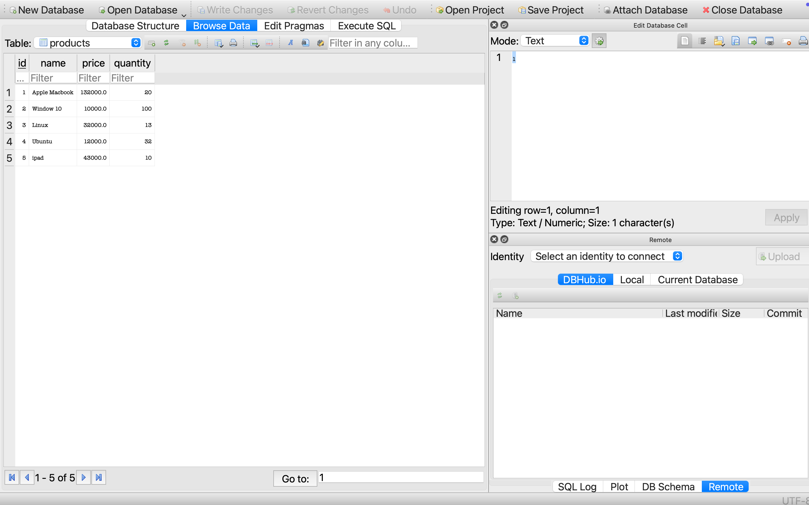

# Inventory and Stock Management System

A simple and effective **command-line Inventory and Stock Management System** built using **C++** and **SQLite3** for persistent data storage. This system allows users to efficiently manage product listings, stock quantities, and perform inventory operations with ease.

## Features

- 📦 Add, update, and delete product listings
- 🔍 View current inventory and search for products
- 📈 Track and manage stock quantities
- 💾 Data persistence using SQLite3
- 🧮 Basic analytics (total stock value, quantity alerts, etc.)
- 🖥️ Command-line interface for ease of use

## Technologies Used

- **C++** for core application logic
- **SQLite3** for database management and persistent storage

## Setup Instructions

### Prerequisites

Make sure you have the following installed:

- C++ Compiler (like `g++`)
- SQLite3 development libraries


## Screenshots



### Clone the Repository

```bash
git clone https://github.com/yourusername/inventory-stock-management.git
cd inventory-stock-management


